# Week 1 - IAM Challenge

## Name
Afroz Shaikh

## Topics Practiced
- Root MFA
- Billing alert
- IAM users and groups
- IAM policies
- Least privilege
- Optional GitHub OIDC

## What I Learned

- What is AWS, AWS regions, availability zones. Secure AWS account by enabling MFA & budget alert.
- IAM basics `Identity + Permissions = Access`, group, role, user, policies, least privilege principle.

## Account Security Lab
### Lab 1

* MFA enabled

   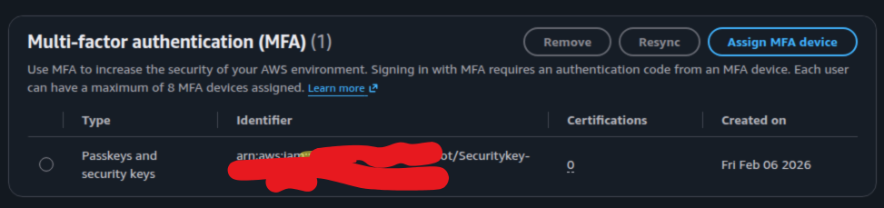

* Root user has full administrative access to all resources and billing, using root user daily compromises security and accidental changes.

### Lab 2

* Budget created 

   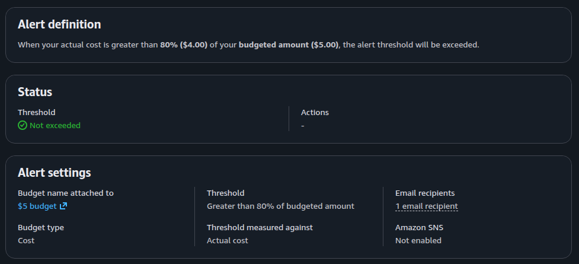

* Billing should be monitored for day1 as AWs used pay-as-you go model so if any resources left running cost can keep increasing, early alert help prevent unexpected charges.

## IAML Lab

* Created groups and users with given policies attached

   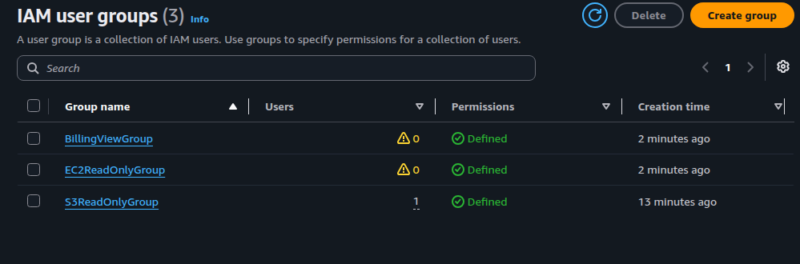

   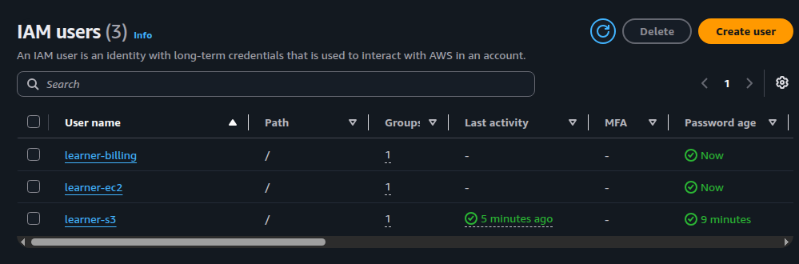

### Lab 1 - S3 Read-Only Access

   - User can view s3

   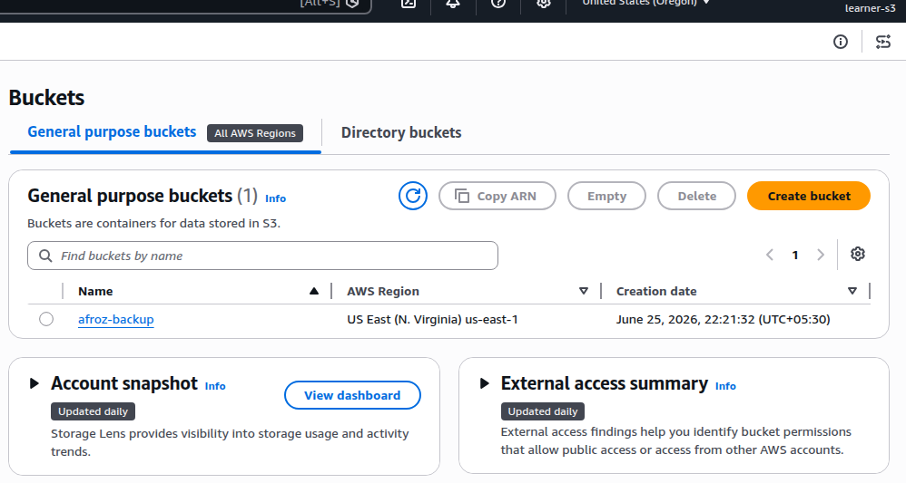

   - User can not create or delete anything

   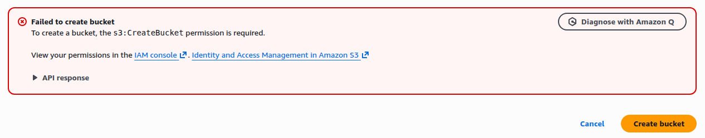

### Lab 2 - EC2 Read-Only Access

   - User can open ec2 dashboard

   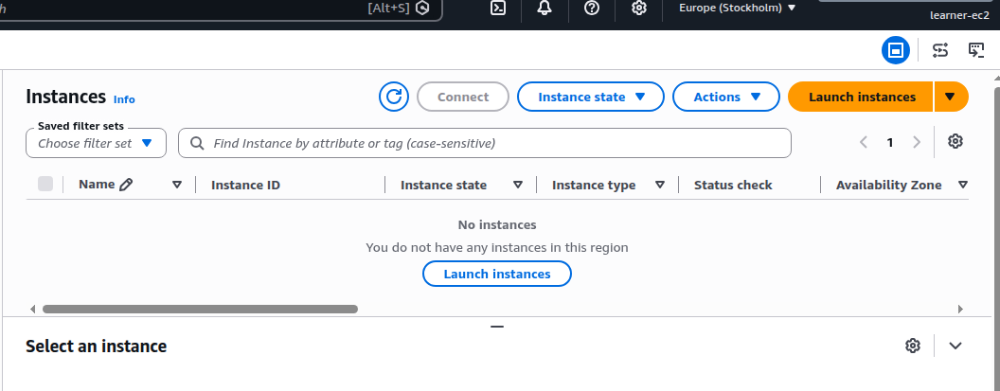

   - User cannot create or terminate instances

   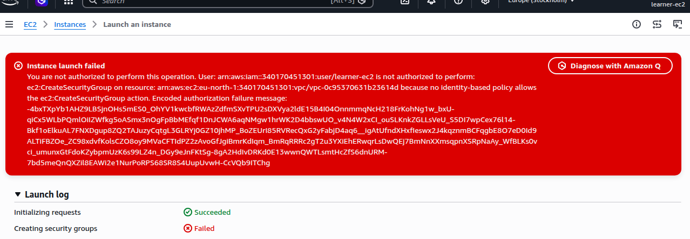

### Lab 3 - Billing Read-Only Access

   - User can view the billing dashboard

   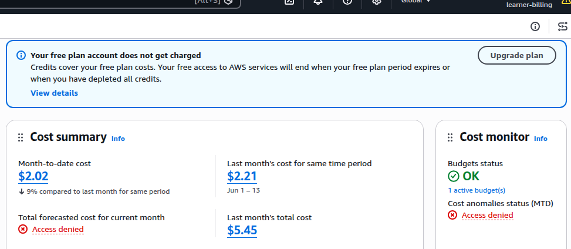

   - User cannot manage unrelated AWS services

   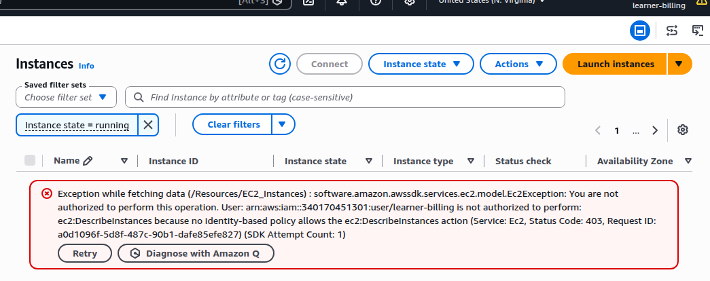

### Lab 4 - Custom S3 Read-Only Policy
   
   - Created and attached custome policy

   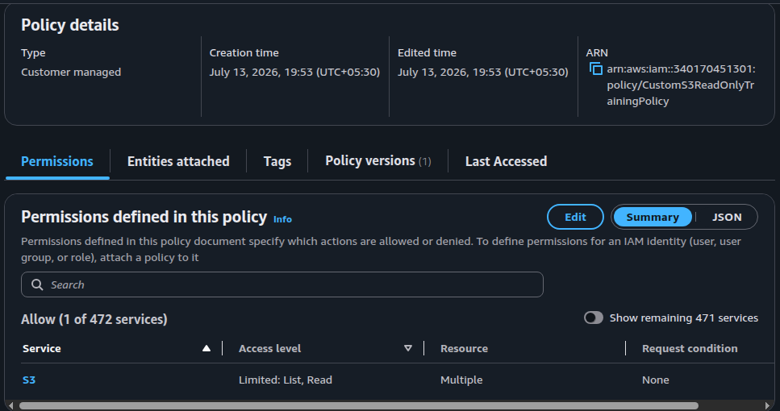

   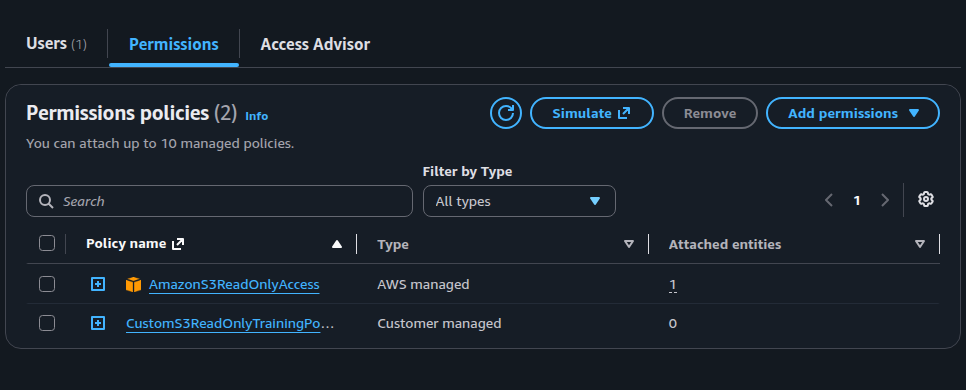

## Where I Got Stuck

I got stuck at billing read only access, even though i gave the read only access it still kept showing denied.

* How I resolved 
   - Go to  Billing and Cost Management.
   - On the left-hand navigate pane, there is account settings.
   - In the IAM User and Role Access to Billing Information section.
   - Check the box Activate IAM Access.

## Key Takeaway
Least privilege means giving only required permissions, nothing extra.