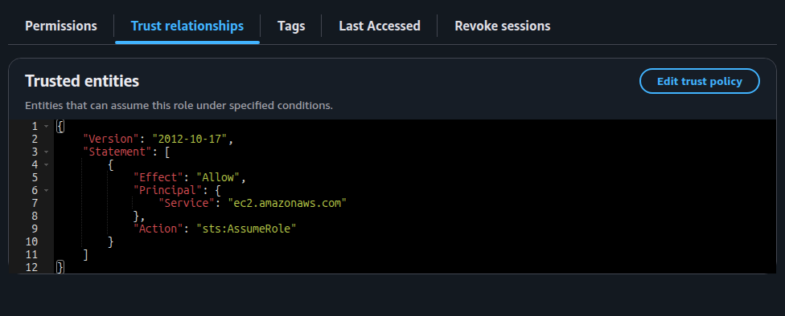
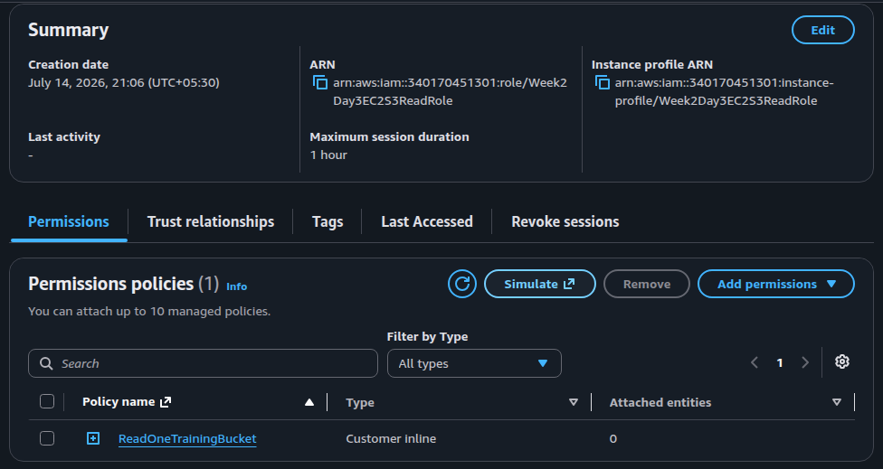
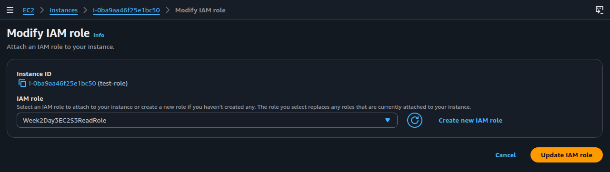
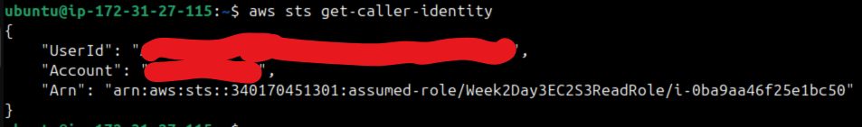
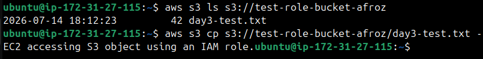
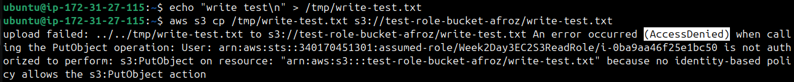

# Week 2 - Day 3: IAM Roles and STS

## Name
Afroz Shaikh

## Topics Practiced
- Trust policy vs permission policy
- STS AssumeRole
- EC2 role and instance profile
- Cross-service role assumption
- Temporary credentials
- Least-privilege S3 access

## What I Built
I attached an IAM role to EC2 and allowed it to read from one S3 bucket without
storing permanent access keys.

## Steps

   - Created s3 bucket
   - Created role with trust policy and inline policy

      

      
   - Launched ec2 instance
   - Attached role to ec2 instance

         

## Allowed Test

   - The caller identity shows an assumed-role identity.
   - The bucket can be listed.
   - The test object can be read.

   

      

## Denied Test

   - AccessDenied, because the permission policy does not allow `s3:PutObject`.

   

## What I Learned
* Trust policy - Defines who(which principal) can assume the role. This is about authentication.
* Permission policy - Defines what actions the role or user can perform ones authenticated. This is about authorization.

## Cleanup
Deleted the s3 bucket, terminated ec2 instance.
Deleted the role.

## LinkedIn Post
Add your post link.