# Week 2 - Day 3: IAM Roles and STS

## Name
Afroz Shaikh

## Topics Practiced
- AWS Organizations account and Organizational Unit (OU) management
- AWS STS identity verification
- IAM identity center
- Cross account control
- Service Control Policies (SCPs)

## What I Built
I implemented an AWS Organizations environment to demonstrate centralized governance using Service Control Policies (SCPs).

- Created an AWS Organization with Management and Member accounts.
- Configured the Dev-Env Organizational Unit (OU).
- Created and attached the Deny-S3-Bucket-Creation Service Control Policy (SCP) to the Dev-Env OU.
- Configured AWS IAM Identity Center and created the CloudAdhar-Demo user.
- Created the CloudAdhar-Admin permission set and assigned it to both the Management and Member accounts.
- Successfully created and deleted an Amazon S3 bucket before SCP enforcement.
- Moved the member account into the Dev-Env OU to inherit the attached SCP.
- Verified that Amazon S3 bucket creation was denied after SCP enforcement.
- Reviewed AWS Organizations consolidated billing.

## Part -1 

   - Identify Root, the management account, and the member account
   - Confirm Dev-Env is empty.
   - Open the OU policies and confirm FullAWSAccess and Deny-S3-Bucket-Creation are applied.
   - Confirm Afroz(CloudAdhar-Dev) is directly under Root, so the OU deny does not yet apply.

      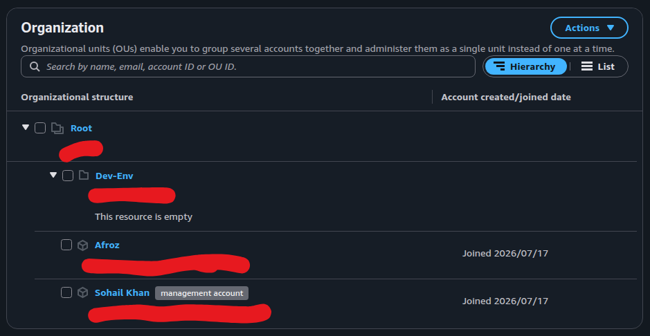

      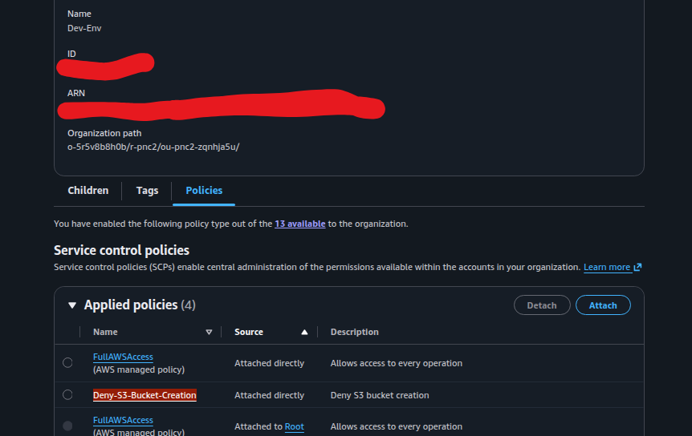

## Part - 2

   - Confirm Sohail(CloudAdhar-Management) and Afroz(CloudAdhar-Dev) are visible.
   - Confirmed the active role was AWSReservedSSO_CloudAdhar-Admin.

      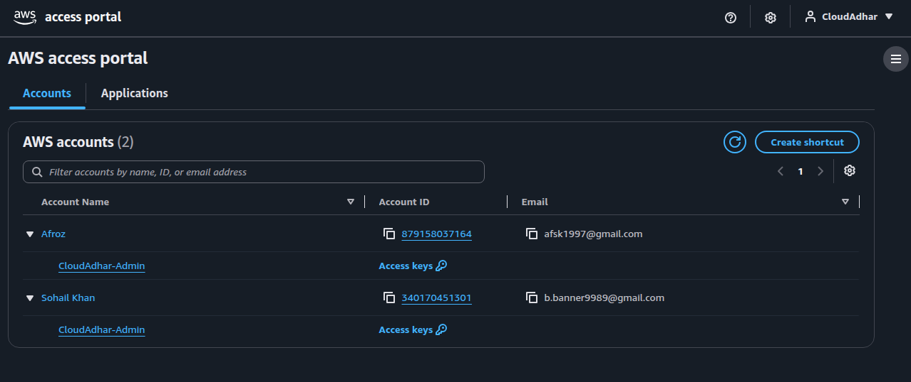

      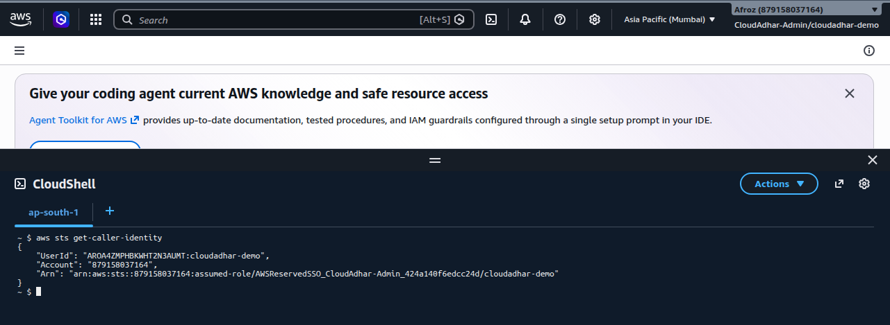

## Part - 3

   - Created s3 bucket with unique bucket name.
   - The account is directly under root so SCP S3CreateBucket deny does not apply here.

      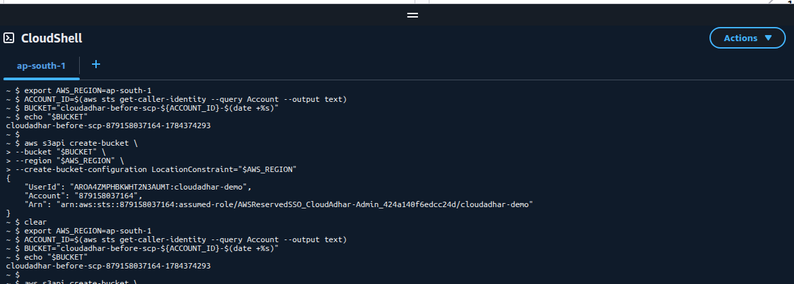
      
      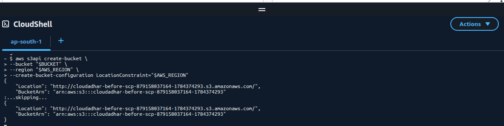

      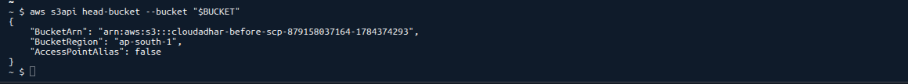      

   - Delete the successfull test bucket

      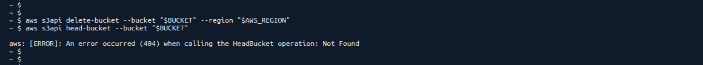

## Part - 4

   - Moved Afroz(Clouadhar-Dev) under Dev-Env OU

      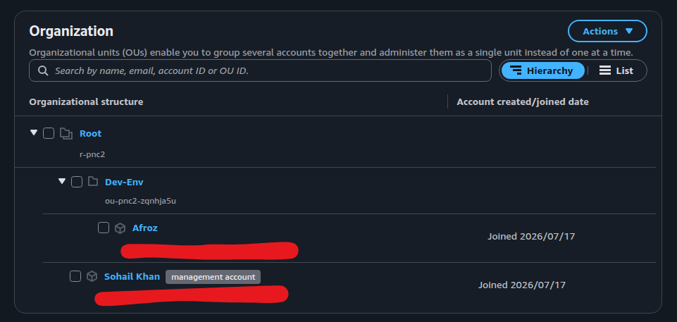

## Part - 5

   - Afroz(CloudAdhar-Dev) is now under OU Dev-Env
   - Tried to create s3 bucket same as we did in part-3
   - Access Denied error because we have applid SCP S3:CreateBucket deny to OU Den-Env

   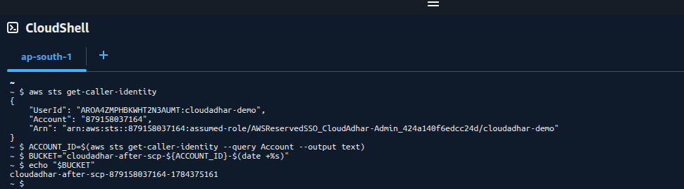

   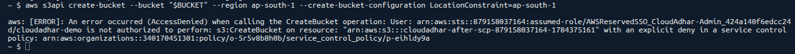

## Part -6 

   - Review Consolidated Billing

   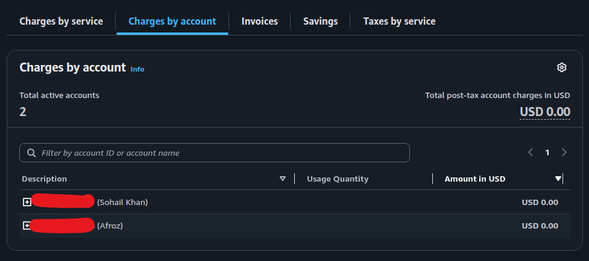

## What I learned

- IAM Identity Center (or IAM roles/policies) can grant a user full access to a service.
- But SCPs act as a guardrail at the account or OU level. They define the maximum allowable permissions for any identity in that scope.
- If an SCP explicitly denies an action (e.g., Deny S3:CreateBucket), that denial overrides any allow statements in IAM policies.
- The evaluation logic is simple: Explicit Deny > Allow > Default Deny. 

## Cleanup
- Deleted the temporary Amazon S3 bucket created during testing.
- Deleted the AWS IAM Identity Center user.
- Removed the Member Account and Organizational Unit (OU).
- Deleted the AWS Organization.
- Verified that no unnecessary billable AWS resources remained.

## LinkedIn Post

> https://www.linkedin.com/posts/afroz-j-shaikh_10weeksofaws-10weeksofaws-aws10weekchallenge-activity-7484226920012734464-3SH8?utm_source=share&utm_medium=member_desktop&rcm=ACoAAGJx1GcBCkf9NyHBHuOyAieNa0GSGTC68FQ